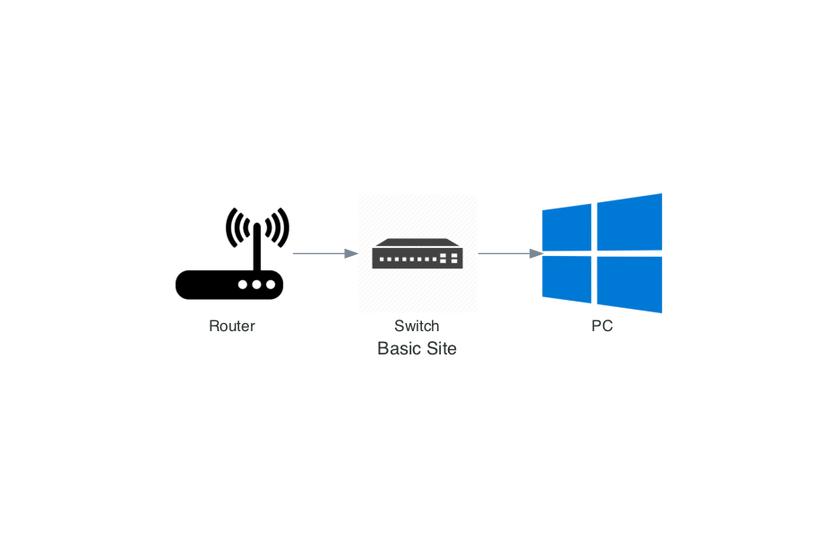
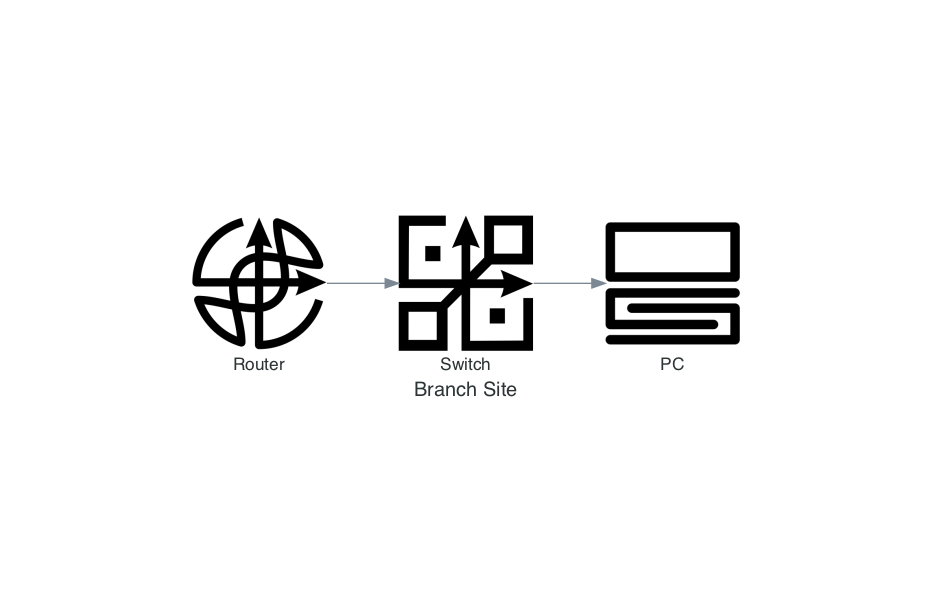

# Diagrams

Example code for generic diagrams using the python diagrams module.

graphviz will also need installed to use the generic diagrams.  
Custom diagrams were created by Russ White at [Rule11.tech](https://rule11.tech).  

Example 1  
  

Example 2  
  